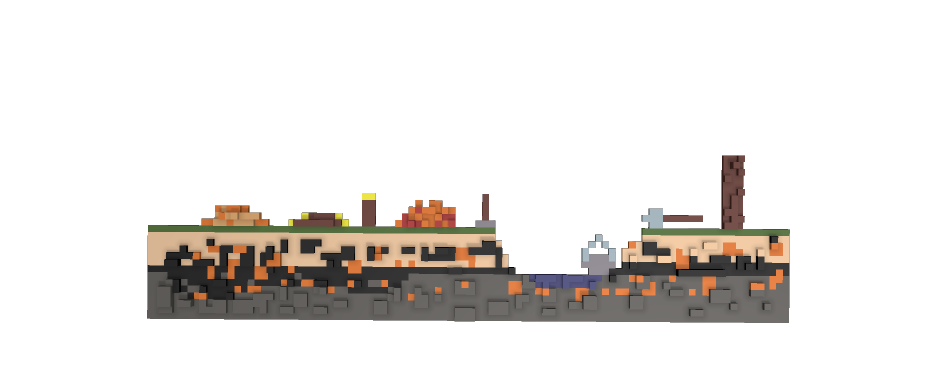
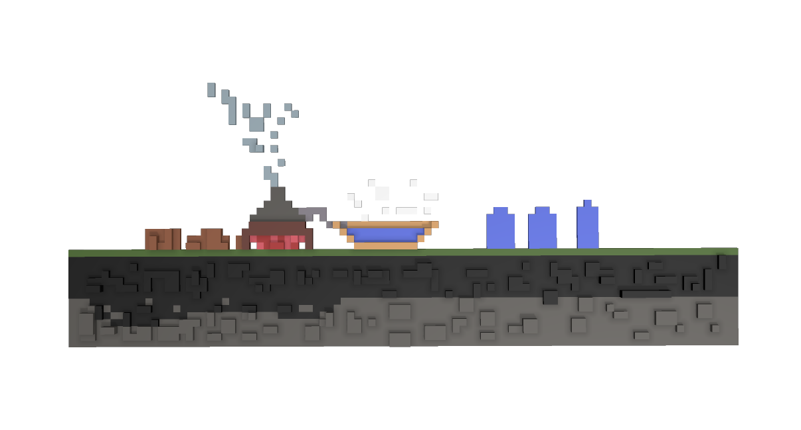

# free_ukrainian_voxel_art
Free Voxel (Goxel/Magica Voxel) Art. Ukraine related art. 

This is the voxel art created by Dmytro Gladkyi and Konstantin Boytsov.
You may use this art in your games or apps. If you decide to do it - leave a link to this repo and mention authors Dmytro Gladkyi and Konstantin Boytsov. That is all.

# How to open gox files
To open the *.gox files use [Goxel Editor](https://goxel.xyz). It has app for all major platforms: macOS, Windows, iOS, Android.

# How to open vox files

To open the *.vox files use [Magica Voxel Editor](https://ephtracy.github.io/).

# How to open obj files

Drag and drop obj/png files into Unreal Engine/Unity editor just like any other asset.

# Usage examples
This art is used in three games: 
- City building game: [Loca Deserta: Sloboda](http://locadeserta.com/citybuilding/index_en.html)
- Hex puzzle: [Loca Deserta: Hex](http://locadeserta.com/locadesertahex/index_en.html)
- Trading game: [Loca Deserta: Chumaki](https://locadeserta.com/locadesertachumaki/index_en.html).

The art is themed in Ukrainian style and is grouped into different folders.

# Folders

## resources

Contains all art related resources/goods/items that can be traded / produced in your game

## Buildings

Contains all art related to buildings. A lot of buildings contain 3 version of the building: level 1-3. Each level represents more developed/upgraded version of the building. Lots of buildings have 2d/3d folders included.

### Amber Mine

### Bakery

### Boat Maker

### Cannon House

### Cart Maker Hut

### Char Coal Maker

### Church

### Distillery

### Field

### Forest

### Honey Maker

### Iron Mine

### Kurin

### Liman

### Marketplace

### Mill

### Pasture

### Powder Hut

### Quarry

### River

### Sawmill

### Shooting Range

### Sich

### Smeltery

### Stables

### Tobacco Maker

### Tower

### Trappers House

### Wall

### Watch Tower

### Wax Maker

### Weavery

## events

Art for different events: merchant visit, failed raid, successfull raid, etc.

# layers
Can be used as parallax background images

# map

Contains tiles for your grid map.

# people

Contains a worker and a cossack.

# research

Several arts for research feature in your game.

# skills
Several arts for the skills in your game.

# world

Contains huge map of south Ukraine and some terrain map.

# Resource Art.

The resource folder includes following 2d and 3d art:

## amber

## boat

## cannon

## cart

## cloth

## coal

## coins

## firearm

## fish

## food

## fur

## gorilka

## grains

## horse

## honey

## iron_ore

## metal_parts

## planks

## powder

## salt

## silk

## stone

## tobacco

## wood

## wool

## wax

